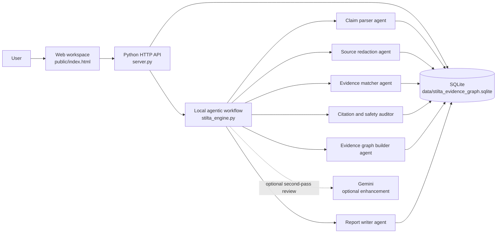
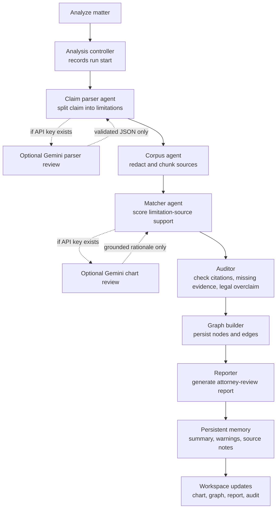
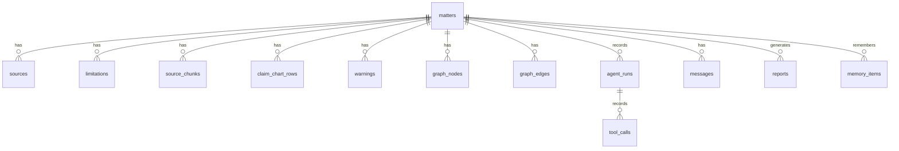
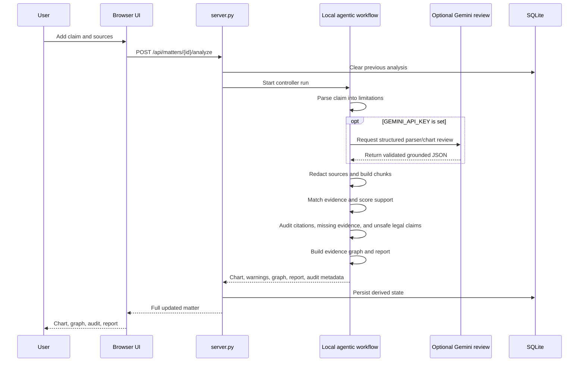

# Stilta Evidence Graph Lab

A working patent evidence workspace for turning claims and messy technical sources into source-backed claim charts, evidence graphs, audit trails, matter-aware chat, and attorney-review reports.

This is not a landing page or a static mockup. It is a real local web app with persistent SQLite storage, a local agentic analysis workflow, optional Gemini review, safety checks, and evals. Gemini is not required to run or test the product.

## Why This Exists

Patent teams spend a lot of time answering one core question:

> Does this patent claim actually map to the evidence in front of us?

That work is slow because claims are written as dense legal text, evidence is scattered across manuals, product docs, prior art, emails, file histories, technical papers, and attorney notes, and every conclusion needs support from a cited source.

Stilta Evidence Graph Lab makes that review workflow concrete:

- Break a patent claim into individual limitations like `1A`, `1B`, `1C`.
- Redact sensitive source text before showing analysis output.
- Match each limitation against uploaded technical sources.
- Produce a claim chart with Strong, Partial, Weak, or Missing support.
- Build an evidence graph that connects matter -> limitation -> snippet -> source.
- Keep an audit trail of every agent stage and tool call.
- Provide matter-aware chat grounded in the current claim chart.
- Generate an attorney-review report with caveats and missing-evidence warnings.

The goal is not to replace patent counsel. The goal is to make evidence review faster, more traceable, and easier to verify.

## Example Use Case

A user has a granted patent claim and a technical manual for an accused product.

The patent claim says the system includes:

- `1A`: a sensor module
- `1B`: a processor comparing readings to thresholds
- `1C`: a network interface sending alerts
- `1D`: a dashboard warning an operator
- `1E`: a payment module

The uploaded manual supports `1A` through `1D`, but says nothing about a payment module.

The app should show:

- Evidence-backed support for `1A` to `1D`.
- `1E` as Missing.
- A warning that the claim is not fully supported by the current source library.
- A report an attorney can review before making any legal conclusion.

## What Users Can Add

Current supported inputs:

- Patent claim text pasted into the claim editor.
- Evidence sources pasted into the source box.
- Text source files imported as `.txt`, `.md`, or `.text`.

Useful source examples:

- Prior art excerpts
- Product manuals
- Technical specifications
- File history notes
- Attorney notes
- Internal product documentation
- Public technical papers

Current sample files:

- `test_evidence/sample_claim.txt`
- `test_evidence/acme_widget_reference.txt`

PDF upload is not implemented yet. The current production-safe path is to extract text from a PDF and add it as a text source. A PDF parser can be added as a next step.

## AI Model Requirement

No AI model is required for the core workflow.

By default, the app runs with a local agentic workflow for:

- Claim splitting
- Source redaction
- Evidence matching
- Support scoring
- Warning generation
- Evidence graph building
- Report rendering

Gemini is an optional enhancement. If `GEMINI_API_KEY` is set, the app uses Gemini for a second-pass review and more natural chat responses. If the key is missing or the API fails, the product still works.

## System Architecture



## Agent Workflow



## Memory And Audit Model



## Request Flow



## Core Features

- Matter workspace with persistent records.
- Direct matter delete and source delete.
- Text and Markdown evidence import.
- Claim decomposition into labeled limitations.
- Source redaction for emails, tokens, keys, and sensitive values.
- Evidence matching with support score and rationale.
- Evidence graph visualization from persisted graph rows.
- Matter-aware chat grounded in current chart and source chunks.
- Attorney-review report endpoint.
- Agent run tracking with real stage status.
- Tool call recording for each major stage.
- Memory items for matter profile, analysis summary, warning summary, and source facts.
- Evals endpoint for grounding and safety checks.

## Safety Boundaries

The app deliberately avoids final legal conclusions.

It can say:

- "This limitation appears supported by Source M20-SRC-001."
- "This limitation is missing support in the current source library."
- "Attorney review is required."

It should not say:

- "This definitely infringes."
- "This patent is invalid."
- "This is a final legal opinion."

The report includes a caveat because this is an attorney-review aid, not legal advice.

## How To Run

From this folder:

```powershell
python server.py
```

Open:

```text
http://127.0.0.1:8020
```

## Optional Gemini Setup

Gemini is optional, not mandatory.

The app works out of the box without an API key using the local agentic workflow. A Gemini key only adds an AI review pass for claim parsing, chart review, and chat wording.

To enable Gemini:

```powershell
$env:GEMINI_API_KEY='your-key'
$env:GEMINI_MODEL='gemini-3.1-pro-preview'
python server.py
```

Never commit API keys to the repository.

## How To Test As A User

1. Open `http://127.0.0.1:8020`.
2. Click `+ New Matter`.
3. Set the matter title to `ACME Widget Review`.
4. Set the review question to `Does Reference D disclose every limitation of claim 1?`.
5. Open `test_evidence/sample_claim.txt` and paste it into `Claim text`.
6. In Evidence Sources, click `Import source file`.
7. Select `test_evidence/acme_widget_reference.txt`.
8. Click `Add Source`.
9. Click `Analyze`.
10. Review the Claim Chart, Evidence Graph, Warnings, Audit, and Report.

Expected result:

- `1A` to `1D` should have support from the uploaded source.
- `1E` should be Missing because the source does not describe a payment module.
- The report should include a missing-evidence warning and attorney-review caveat.

## Chat Questions To Try

```text
Which claim elements are missing support?
```

```text
Show me the strongest evidence for 1B.
```

```text
What should an attorney review before relying on this chart?
```

```text
Which source snippets support the dashboard limitation?
```

## API Surface

```text
GET    /api/state
GET    /api/evals
GET    /api/matters/{id}
GET    /api/matters/{id}/report
POST   /api/matters
POST   /api/matters/{id}/update
POST   /api/matters/{id}/sources
POST   /api/matters/{id}/analyze
POST   /api/matters/{id}/chat
DELETE /api/matters/{id}
DELETE /api/matters/{id}/sources/{source_id}
```

## Test Suite

```powershell
python -m unittest -v test_stilta.py
```

The tests cover:

- Claim splitting
- Source redaction
- Evidence matching
- Overlap terms
- Missing evidence
- Invented citation warnings
- Legal overclaim warnings
- Matter-aware chat
- Gemini hook usage when available
- Agent runs, tool calls, and memory writes
- Source and matter deletion cleanup
- Eval endpoint behavior

## Implementation Notes

The app intentionally uses a small stack:

- Python standard library HTTP server
- SQLite for persistence
- Vanilla HTML, CSS, and JavaScript
- Optional Gemini client
- No external frontend framework required

This keeps the demo easy to run, inspect, and extend.

## Production Additions Worth Building Next

- PDF and DOCX ingestion with page-level citations.
- OCR for scanned patent exhibits.
- Real embedding search for large source libraries.
- User accounts and matter-level permissions.
- Export to PDF and DOCX.
- Versioned claim charts with attorney comments.
- Side-by-side cited source viewer.
- Human review queue for low-confidence matches.
- Background jobs for large matters.
- Deployment hardening, auth, rate limits, and secrets management.

## Project Structure

```text
StiltaEvidenceGraphLab/
  public/
    index.html
    static/
      app.js
      styles.css
  data/
    stilta_evidence_graph.sqlite
  test_evidence/
    sample_claim.txt
    acme_widget_reference.txt
  gemini_client.py
  server.py
  stilta_engine.py
  stilta_memory.py
  test_stilta.py
```

## The Important Product Bet

The valuable part is not "AI chat for patents."

The valuable part is a traceable evidence system:

- Every claim element is explicit.
- Every support statement points to a source.
- Every missing piece is visible.
- Every agent stage is recorded.
- Every final output is framed for attorney review.

That is the difference between a chatbot answer and a workflow a patent team can actually trust.
